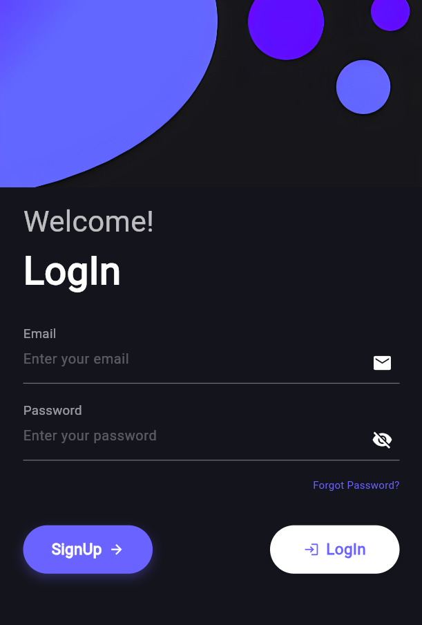
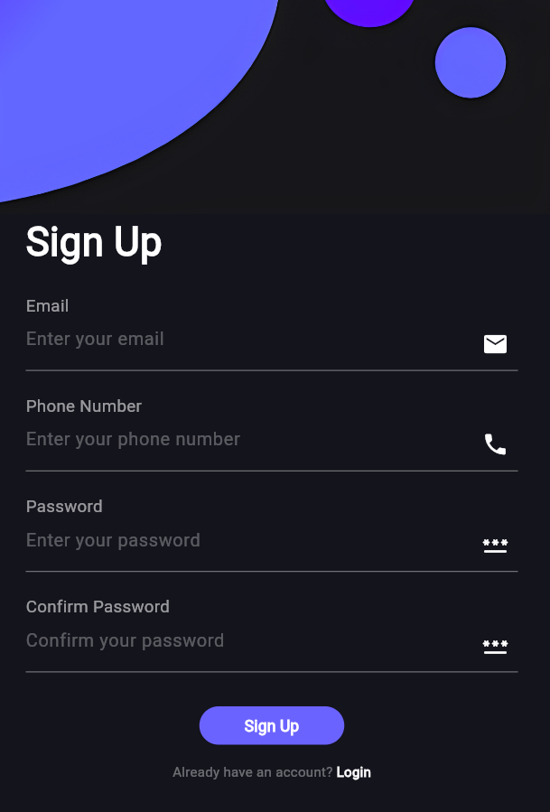

# Responsive Flutter Login UI

A modern, responsive login and signup UI built with Flutter. This project showcases a sleek authentication interface that adapts to different screen sizes, from mobile to tablet and desktop.

## 📱 Features

- **Responsive Design**: Adapts to different screen sizes
- **Beautiful UI/UX**: Modern design with a dark theme
- **Animated Elements**: Smooth transitions and animations
- **Authentication Flow**: Complete login and signup flows
- **Material 3 Design**: Uses Flutter's Material 3 design system

## 🖼️ Screenshots

<table>
  <tr>
    <td>Login Screen</td>
    <td>Signup Screen</td>
  </tr>  <tr>
    <td></td>
    <td></td>
  </tr>
</table>

## 🚀 Getting Started

### Prerequisites

- Flutter SDK (3.7.0 or higher)
- Dart SDK
- Android Studio / VS Code
- Git

### Installation

1. Clone the repository:
   ```
   git clone https://github.com/deba75/flutter-responsive-login-signup.git
   ```

2. Navigate to the project directory:
   ```
   cd flutter-responsive-login-signup
   ```

3. Install dependencies:
   ```
   flutter pub get
   ```

4. Run the app:
   ```
   flutter run
   ```

## 🛠️ Built With

- [Flutter](https://flutter.dev/) - UI framework
- [Provider](https://pub.dev/packages/provider) - State management
- [Shared Preferences](https://pub.dev/packages/shared_preferences) - Local storage
- [Flutter SVG](https://pub.dev/packages/flutter_svg) - SVG rendering
- [Animated Text Kit](https://pub.dev/packages/animated_text_kit) - Text animations

## 📋 Project Structure

```
lib/
  ├── main_new.dart        # Application entry point
  ├── pages/
  │   ├── login_new.dart   # Login screen
  │   ├── signUp_new.dart  # Signup screen
  │   └── home.dart        # Home screen
  └── theme/
      └── theme_provider.dart  # Theme management
```

## 🤝 Contributing

Contributions, issues, and feature requests are welcome! Feel free to check the [issues page](https://github.com/deba75/flutter-responsive-login-signup/issues).

## 📝 License

This project is licensed under the MIT License - see the LICENSE file for details.

## 🙏 Acknowledgements

- [Flutter Documentation](https://flutter.dev/docs)
- [Material Design](https://material.io/)
- [Flutter Community](https://flutter.dev/community)
